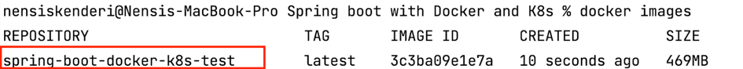
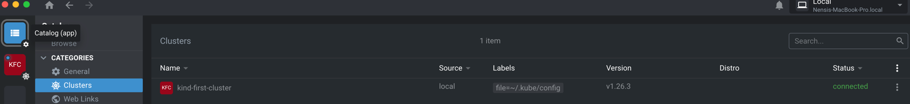

## Spring Boot with DOCKER and K8s

Prerequisites:

* kubectl
* kind
* kubernetes lens (optional)

#### Here are the general steps to deploy a Spring Boot application to Kubernetes:
1. **Create a Docker image of your Spring Boot application:** 
Before you can deploy your Spring Boot application to Kubernetes, you need to create a Docker image of your application. You can do this by creating a Dockerfile that defines the build steps for your application.
We will be using the multi-stage concept of Docker. You can find more info on that here:
[https://docs.docker.com/build/building/multi-stage/](https://docs.docker.com/build/building/multi-stage/)

Since we only need the jar file and not other files we perform multi-stage build like shown here: 

FROM --platform=linux/arm64/v8 maven:3.8.3-openjdk-17 AS build
COPY src /app/src
COPY pom.xml /app
RUN mvn -f /app/pom.xml clean package

In the next step we just copy and run the jar file like shown here: 

FROM eclipse-temurin:17-jdk-jammy
COPY --from=build /app/target/spring-boot-docker-k8s-0.0.1-SNAPSHOT.jar /app/app.jar
EXPOSE 9090
CMD ["java", "-jar", "/app/app.jar"]

To build the image run: 
   `docker build -t spring-boot-docker-k8s-test .`

To check if the image is created run: 
   `docker images`

 
 
 
 

2. **Push the Docker image to a container registry:** 
   For training purposes I am using public Docker Hub registry so that Kubernetes
   can pull the image without authentication.
Once you have created a Docker image of your Spring Boot application, you need to push the image to a container registry such as Docker Hub or Google Container Registry.
I am choosing Docker Hub. Before we push we should change the tag name to the repo
of the container registry which is **_nensiskenderi/spring-boot-docker-k8s-test_**

Use the following command to change the tag: 
`docker tag spring-boot-docker-k8s-test nensiskenderi/spring-boot-docker-k8s-test:v.0.0.1`

And use the following to push: 
`docker push nensiskenderi/spring-boot-docker-k8s-test:v.0.0.1`

 
 
 
 

3. **Create Local Kubernetes Cluster using Kind tool**

There are many ways of creating a K8s cluster
* we can use Cloud Providers like AWS, Google, Azure 
* setup k8s on bare-metal virtual machine
* install it locally using kind tool (this is the approach we are going to use here)

to create the local k8s using kind tool we execute the following command: 
   `kind create cluster --name first-cluster`

 
 
 
 

4. **Define Kubernetes deployment configuration:**
Next, you need to define the Kubernetes deployment configuration for your application. This includes defining the Docker image to use, number of replicas, and any required environment variables.
To do this, we create the file name **_deployment.yaml_** which you can find in the dir.

 
 

5. **Deploy the application to Kubernetes:**
   To deploy our app to Kubernetes we execute the following command: 
   `kubectl apply -f deployment.yaml` 